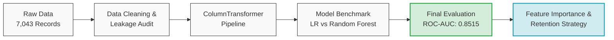

# telco-customer-churn-prediction
Predicting telecommunication customer churn and driving actionable retention strategies using machine learning (logistic regression &amp; random forest).
import pandas as pd
import numpy as np
import matplotlib.pyplot as plt
import seaborn as sns

# Vizualization Setup
sns.set_theme(style="whitegrid")
plt.rcParams['figure.figsize'] = (10, 6)

file_path = 'Telco_customer_churn.xlsx'
df = pd.read_excel(file_path)

print(f"{df.shape[0]} baris, {df.shape[1]} kolom")
print(df.info())
df.head()

# Data Cleaning
# Mengubah spasi kosong string menjadi NaN lalu float pada kolom Total Charges
df['Total Charges'] = df['Total Charges'].replace(" ", np.nan)
df['Total Charges'] = df['Total Charges'].astype(float).fillna(0)

# Hapus kolom ID lokasi dan DATA LEAKAGE (fitur yang baru ada setelah pelanggan churn)
drop_cols = [
    'CustomerID', 'Count', 'Country', 'State', 'City', 'Zip Code', 
    'Lat Long', 'Latitude', 'Longitude', 'Churn Label', 
    'Churn Reason', 'Churn Score', 'CLTV'
]

df_clean = df.drop(columns=[col for col in drop_cols if col in df.columns])
df_clean['Churn Value'].value_counts(normalize=True)

corr = df_clean.apply(lambda x: pd.factorize(x)[0]).corr(method='spearman')
top_corr = corr['Churn Value'].sort_values(ascending=False)
top_corr

# Visualisasi hubungan Churn dengan Tipe Kontrak & Masa Berlangganan
fig, axes = plt.subplots(1, 2, figsize=(14, 5))

# Tingkat Churn berdasarkan Jenis Kontrak
contract_churn = df_clean.groupby('Contract')['Churn Value'].mean().reset_index()
sns.barplot(data=contract_churn, x='Contract', y='Churn Value', ax=axes[0], palette='Blues_r')
axes[0].set_title('Churn Rate Berdasarkan Jenis Kontrak', fontsize=12, fontweight='bold')
axes[0].set_ylabel('Proporsi Churn')
axes[0].set_ylim(0, 0.6)

# Distribusi Tenure Months
sns.kdeplot(data=df_clean, x='Tenure Months', hue='Churn Value', common_norm=False, fill=True, ax=axes[1], palette='tab10')
axes[1].set_title('Distribusi Masa Berlangganan (Tenure) vs Churn', fontsize=12, fontweight='bold')

plt.tight_layout()
plt.show()

from sklearn.model_selection import train_test_split
from sklearn.preprocessing import OneHotEncoder, StandardScaler
from sklearn.compose import ColumnTransformer

X = df_clean.drop('Churn Value', axis=1)
y = df_clean['Churn Value']

# Stratified Split (80% Train, 20% Test) agar rasio churn sama persis di kedua subset
X_train, X_test, y_train, y_test = train_test_split(
    X, y, test_size=0.2, random_state=42, stratify=y
)

# Identifikasi kolom numerik dan kategorikal
cat_cols = X.select_dtypes(include=['object']).columns.tolist()
num_cols = X.select_dtypes(include=['int64', 'float64']).columns.tolist()

# Standardisasi angka dan One-Hot Encoding teks
preprocessor = ColumnTransformer(
    transformers=[
        ('num', StandardScaler(), num_cols),
        ('cat', OneHotEncoder(drop='first', handle_unknown='ignore'), cat_cols)
    ]
)

from sklearn.pipeline import Pipeline
from sklearn.linear_model import LogisticRegression
from sklearn.metrics import classification_report, roc_auc_score, confusion_matrix, ConfusionMatrixDisplay

# Baseline Pipeline dengan penyeimbang bobot kelas
clf_lr = Pipeline(steps=[
    ('preprocessor', preprocessor),
    ('classifier', LogisticRegression(class_weight='balanced', random_state=42, max_iter=1000))
])

# Training model
clf_lr.fit(X_train, y_train)
# Melakukan prediksi pada data uji
y_pred_lr = clf_lr.predict(X_test)
y_proba_lr = clf_lr.predict_proba(X_test)[:, 1]

print("EVALUASI (LOGISTIC REGRESSION)")
print(classification_report(y_test, y_pred_lr))
print("ROC-AUC Score:", round(roc_auc_score(y_test, y_proba_lr), 4))

from sklearn.ensemble import RandomForestClassifier

# Pipeline Random Forest
clf_rf = Pipeline(steps=[
    ('preprocessor', preprocessor),
    ('classifier', RandomForestClassifier(n_estimators=150, max_depth=8, class_weight='balanced', random_state=42))
])

clf_rf.fit(X_train, y_train)
y_pred_rf = clf_rf.predict(X_test)
y_proba_rf = clf_rf.predict_proba(X_test)[:, 1]

print("EVALUASI(RANDOM FOREST)")
print(classification_report(y_test, y_pred_rf))
print("ROC-AUC Score:", round(roc_auc_score(y_test, y_proba_rf), 4))

# Ambil fitur yang telah di-encode
encoder = clf_rf.named_steps['preprocessor'].named_transformers_['cat']
cat_feature_names = encoder.get_feature_names_out(cat_cols)
all_feature_names = num_cols + list(cat_feature_names)

# Ambil nilai feature importance dari Random Forest
importances = clf_rf.named_steps['classifier'].feature_importances_
feat_importances = pd.Series(importances, index=all_feature_names).sort_values(ascending=False).head(10)

plt.figure(figsize=(9, 5))
feat_importances.plot(kind='barh', color='steelblue').invert_yaxis()
plt.title('Top 10 Feature Importance')
plt.tight_layout()
plt.show()

# Telco Customer Churn Prediction & Retention Strategy

Proyek machine learning untuk mendeteksi pelanggan telekomunikasi yang berisiko churn serta merumuskan strategi retensi berbasis data.

---

## Project Overview & Workflow
- **Data Preprocessing:** Pembersihan data, penanganan data leakage, dan standardisasi/encoding menggunakan `ColumnTransformer`.
- **Handling Imbalance:** Menggunakan penyeimbang bobot kelas (`class_weight='balanced'`).
- **Modeling:** Komparasi model baseline (Logistic Regression) vs model ensemble (Random Forest).

---

## Model Performance Comparison

| Model | Accuracy | Precision (Class 1) | Recall (Class 1) | F1-Score (Class 1) | ROC-AUC |
| :--- | :---: | :---: | :---: | :---: | :---: |
| **Logistic Regression (Baseline)** | 0.74 | 0.51 | **0.78** | 0.62 | 0.8489 |
| **Random Forest (Ensemble)** | **0.76** | **0.53** | 0.77 | **0.63** | **0.8515** |

The Random Forest model was selected as the final model because it delivered superior accuracy (76%) and ROC-AUC (0.8515), as well as better churn prediction precision (53%), with a very minimal trade-off in recall reduction (77%)

---

## Key Findings & Business Recommendations
1. **Tenure Months & Contract:** Masa awal berlangganan (0–10 bulan) dan kontrak bulanan (*Month-to-month*) menyumbang risiko churn tertinggi. Sebaliknya, kontrak jangka panjang (1–2 tahun) memangkas churn secara drastis.
2. **Biaya Layanan:** Beban tagihan bulanan (`Monthly Charges` dan `Total Charges`) menjadi pemicu penting pelanggan mempertimbangkan pindah provider.
3. **Action Plan:**
   - Fokuskan pendampingan retensi (*customer onboarding*) intensif pada 3–6 bulan pertama.
   - Buat penawaran diskon/insentif bagi pelanggan *month-to-month* agar bersedia beralih ke kontrak minimal 1 tahun.
